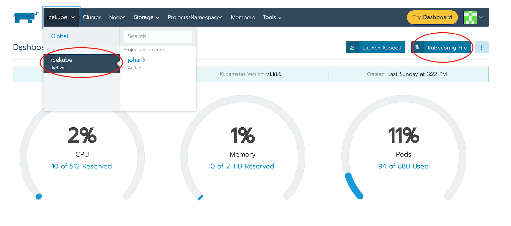
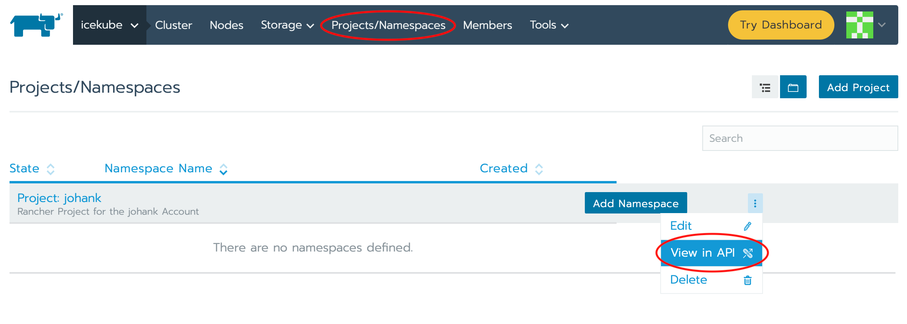
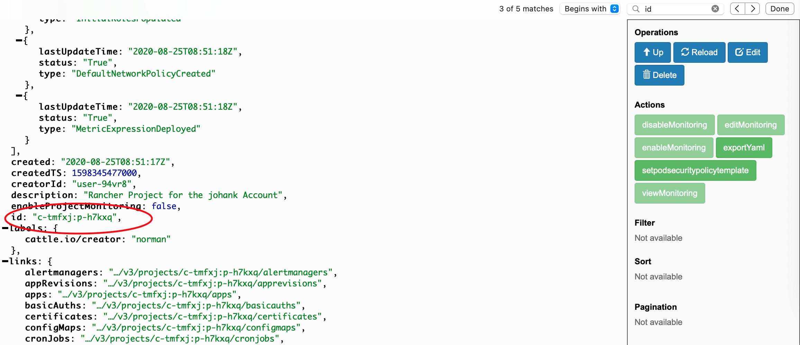

# How to use BalticLSC Kubernetes APIs?
The BalticLSC Kubernetes platform is implemented as a shared multi-tenant Kubernetes cluster. This means that all users share the same Kubernetes infrastructure. The advantage of this approach is that it becomes possible to more efficiently utilize the hardware such as easily scale up or down a service, or having to bother about provisioning virtual machines or bare metal servers, which may also become under-utilized if not fully used by the user.

The BalticLSC platform is using the [Rancher Kubernetes management platform](https://rancher.com) to securely separate users from each other. Each user has access to their own Rancher project, which is sandboxed and cannot be accessed by other users on the BalticLSC platform. However, this approach adds additional requirements on how to use Kubernetes APIs such as the Kubernetes CLI (kubectl) or REST APIs.

## Getting started
1. To use **kubectl** you need to fetch a Kubeconfig file. Login to the [Rancher Web UI].

2. Click on the icekube cluster (top red circle in the picture above). Click on Kubeconfig File button, and the download the config file (or store in your clipboard). Save the file to ~/.kube/config.
3. You are now ready to the the **kubectl** tool.

## Namespaces
### Creating namespaces
To create a new namespace, the users must specify a special annotation (**field.cattle.io/projectId)** telling the BalticLSC platform which project the namespace should be bound to. Typically, this is not needed in a standard Kubernetes deployment, but this is required as the users can be member of several projects and the system needs to know which project to bind the namespace to. Note that the (**field.cattle.io/projectId)** is automatically set when using the Rancher REST API or the Rancher Web UI.

Below is an example how to create a namespace. 

```yaml
apiVersion: v1
kind: Namespace
metadata:
  name: johank-myfirstns 
  annotations:
    field.cattle.io/projectId: c-tmfxj:p-h7kxq 
```

To create the namespace, try the following command:

```
$ kubectl create -f myfirstns.yaml
```

#### How to figure out the ProjectId?


The **projectId** can either be obtained by using the [Rancher Web UI](https://k8s.ice.ri.se). This can be done by clicking on the **Projects/Namespaces** tab button in top menu (see the red markings in the picture below), then select a project and after that click on **View in API** button on the chosen project, and finally search for the **id** attribute.



The BalticLSC will also propose possible projectId annotations if the **field.cattle.io/projectId** annotation is missing, which can be another way to figure it put. Below is an example such an error:

```
$ kubectl create -f mynamespace.yaml

Error from server: admission webhook "iceguard-server.iceguard-webhook.svc" denied the request: Failed to find field.cattle.io/projectId annotation, please add it to your yaml file, here are some suggestions:

To add a new namespace to project: johank, try the following yaml:
apiVersion: v1
kind: Namespace
metadata:
   annotations:
       field.cattle.io/projectId:  c-tmfxj:p-h7kxq
```

Note that an error message will be generated if the user specifies a projectId which is the user is not a member of.

### Naming requirements
In addition to the **projectId** annotation, the BalticLSC Kubernetes platform imposes several restrictions on how namespaces are named. This is to ensure namespaces are globally unique on the BalticLSC platform.

1. A namespace name must be prefixed with the username, e.g. johank-mynamespace
2. A namespace name cannot be empty or contain characters like _, <> etc. Dash (-) is okey though.

An error message will be generated if the namespace is invalid, including a suggestion how to resolve the problem.

### Managing quotas
By default, a namespace inherits the default limits and requests (reservation) values specified for the user's Rancher project. An error will be generated if any of these values exceed the project quotas.

However, a user can override the default values and specify resource limits for a specific namespace. This makes it possible to give a certain namespace more resources than another. Two additional annotations are used specify resource and request limits for a namespace, as shown below:

```yaml
field.cattle.io/containerDefaultResourceLimit: '{"limitsCpu":"500m","limitsMemory":"256Mi","requestsCpu":"500m","requestsMemory":"256Mi"}'
field.cattle.io/resourceQuota: '{"limit":{"requestsCpu":"1000m","requestsMemory":"1024Mi","requestsStorage":"1Gi","limitsCpu":"1000m","limitsMemory":"1024Mi"}}'
```

The following attribute values are possible to specify in the JSON format above. 

* limitsCpu
* limitsMemory
* persistentVolumeClaims
* requestsCpu
* requestsMemory
* requestsStorage

Below is an example of YAML file. 

```yaml
apiVersion: v1
kind: Namespace
metadata:
  name: johank-myfirstns
  annotations:
    field.cattle.io/projectId: c-tmfxj:p-h7kxq
    field.cattle.io/containerDefaultResourceLimit: '{"limitsCpu":"500m","limitsMemory":"256Mi","requestsCpu":"500m","requestsMemory":"256Mi"}'
    field.cattle.io/resourceQuota: '{"limit":{"requestsCpu":"1000m","requestsMemory":"1024Mi","requestsStorage":"1Gi","limitsCpu":"1000m","limitsMemory":"1024Mi"}}'
```

Note that the annotations above are automatically set by Rancher if the namespace is created from the [Rancher Web UI](https://k8s.ice.ri.se). Also note that the **field.cattle.io/containerDefaultResourceLimit** is optional, but the user must manually set limits on Pods if not specified. See the next section more information.

## Deploying PODs 
To deploy a Kubernetes Pod/Service or Deployment the following requirements must be met:

1. A namespace must be specified, and the user must be a member of the project where the specified namespace is bound to.
2. Both resource and request limits must be specified unless default values (**field.cattle.io/containerDefaultResourceLimit**) have been set. See the previous section.
3. The request limit (reservation) cannot be higher than the limit values.
4. Sufficient amount of resources must available in the project.

An error message will be generated if any of the requirements above are not met.

Below is an example of a Pod YAML resource file:

```yaml
apiVersion: v1
kind: Pod
metadata:
  name: testpod
spec:
  containers:
  - name: bb
    image: busybox
    command:
      - sleep
      - "3600"
    resources:
      requests:
        memory: "128Mi"
        cpu: "600m"
      limits:
        memory: "128Mi"
        cpu: "600m"
```

Try the following command to to deploy the Pod resource described above:

```yaml
$ kubectl create -f testpod.yaml -n johank-myfirstns
```

## Using GPUs 
TODO

## Using BalticLSC Kubernets APIs
TODO
