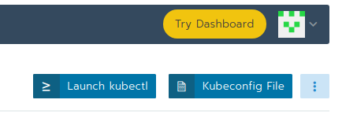
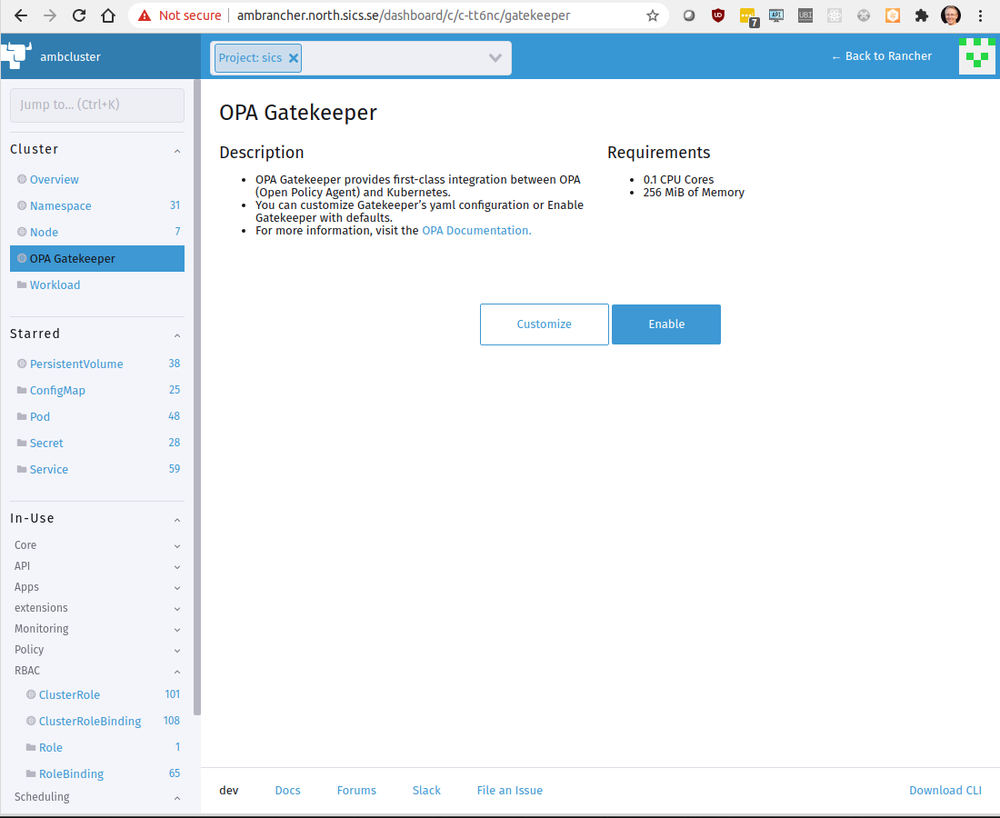

# Installation

1. Start rancher dashboard



2. Enable OPA Gatekeeper



3. Feed ingress conflict handling rules to gatekeeper:
```
kubectl apply -f conf/sync.yaml
kubectl apply -f conf/k8suniqueingresshost_template.yaml
kubectl apply -f conf/unique-ingress-host_constraint.yaml
```


