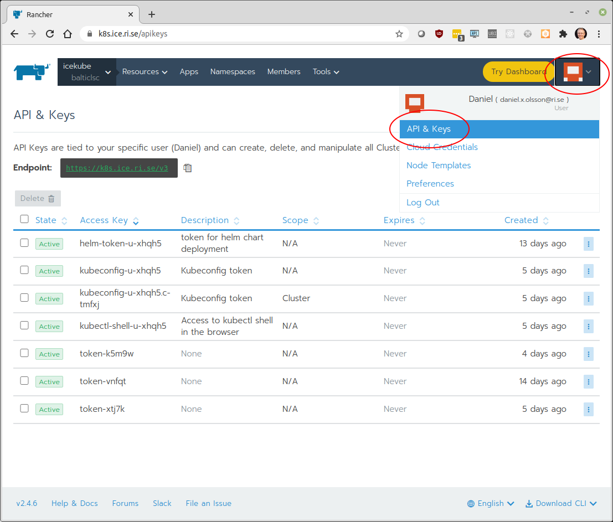
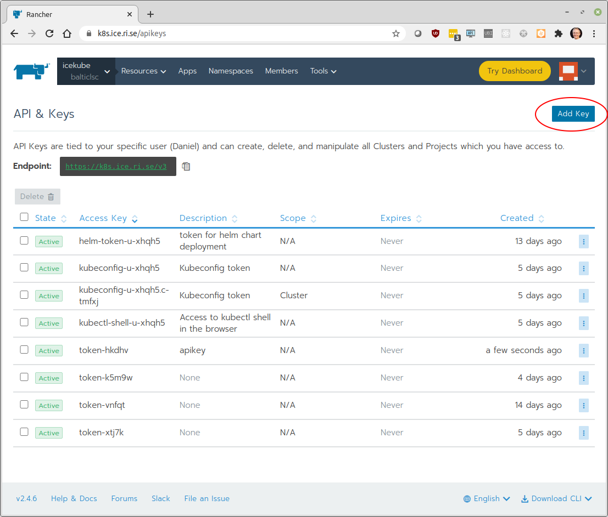
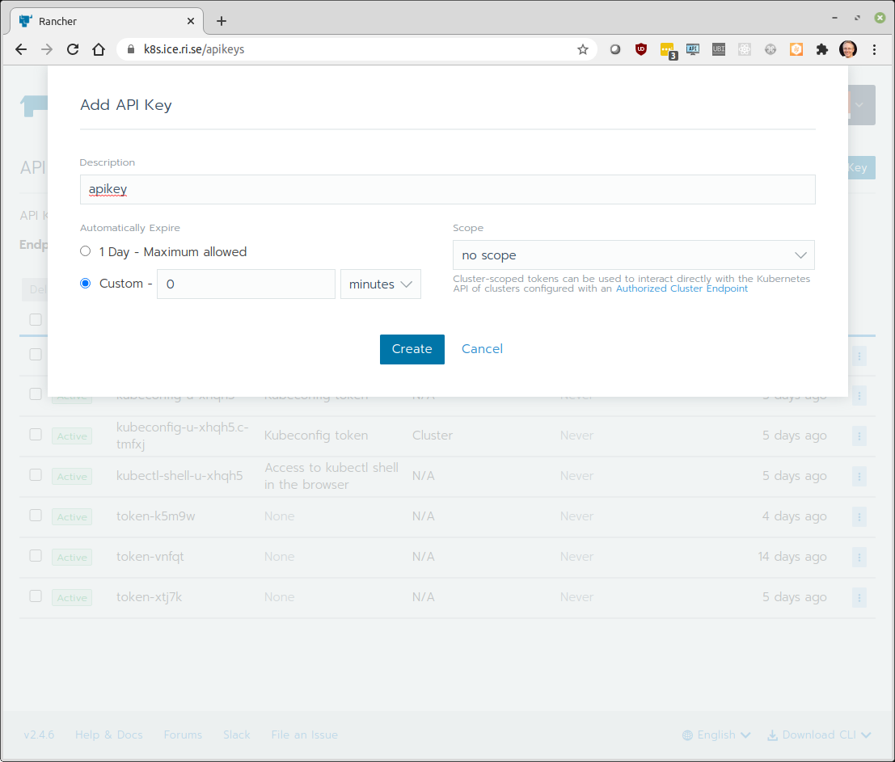
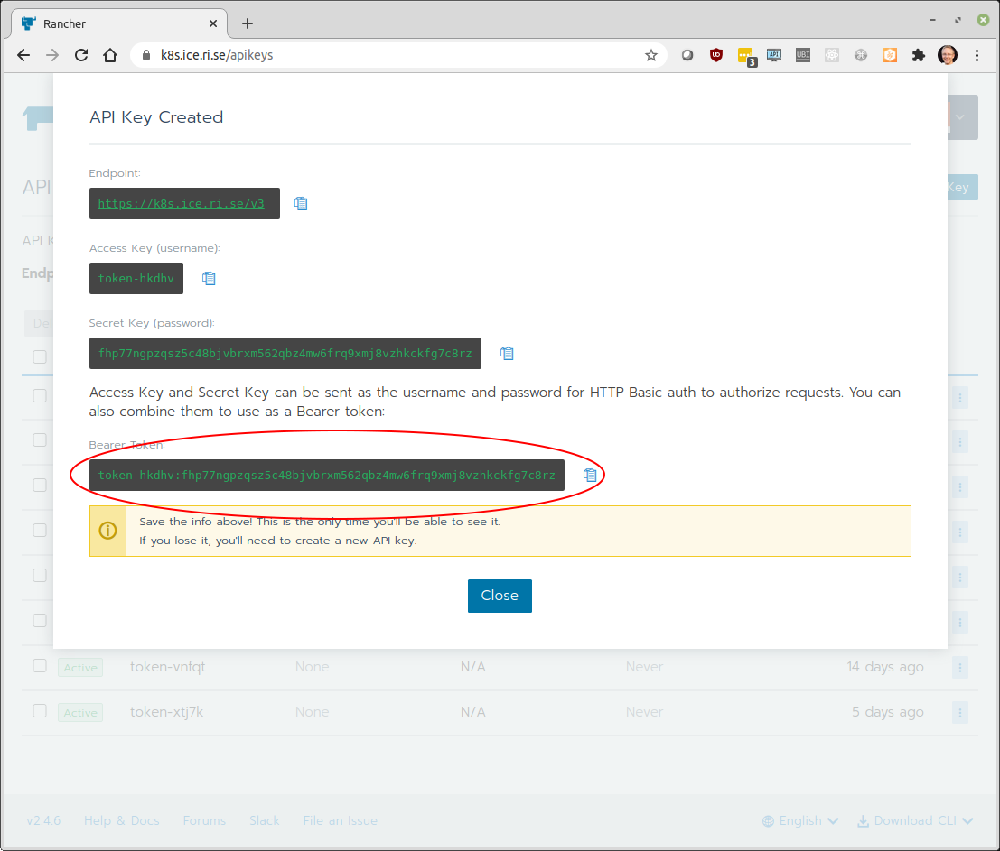

# Resource usage API
API requests must include authentication information. Authentication is done using [Basic access authentication](https://en.wikipedia.org/wiki/Basic_access_authentication) using API keys. 

## Generate API key
To be able to use the API an API key needs to be generated. Login to Rancher and go to API & Keys.



Here click on *Add Key*



Enter fields as in screenshot and click *Create*



And then store the generated API token



## Using the authentication key
Following script demonstrates the use of the API key using [curl](https://curl.haxx.se/):

```bash
#!/bin/bash

# API token
AUTHTOKEN="token-hkdhv:fhp77ngpzqsz5c48bjvbrxm562qbz4mw6frq9xmj8vzhkckfg7c8rz"

# Request payload
JSON='{"filters":{"resourceType":"pod","projectId":"c-tmfxj:p-vxl6k"},"metricParams":{"podName":"balticlsc-jlab:ssdl-jupyterlab-lab-766fcb86c5-r6ttr"},"interval":"5s","isDetails":true,"from":"now-5m","to":"now"}'

curl -u ${AUTHTOKEN} -d ${JSON} -X POST https://k8s.ice.ri.se/v3/projectmonitorgraphs?action=query
```

## Making requests
The API is generally RESTful but has several features to make the definition of everything discoverable by a client so that generic clients can be written instead of having to write specific code for every type of resource. For detailed info about the generic API spec, [see here](specification.md).

* Every type has a Schema which describes:

    * The URL to get to the collection of this type of resources
    * Every field the resource can have, along with their type, basic validation rules, whether they are required or optional, etc.
    * Every action that is possible on this type of resource, with their inputs and outputs (also as schemas).
    * Every field that filtering is allowed on
    What HTTP verb methods are available for the collection itself, or for individual resources in the collection.

* So the theory is that you can load just the list of schemas and know everything about the API. This is in fact how the UI for the API works, it contains no code specific to Rancher itself. The URL to get Schemas is sent in every HTTP response as a **X-Api-Schemas** header. From there you can follow the **collection** link on each schema to know where to list resources, and other **links** inside of the returned resources to get any other information.

* In practice, you will probably just want to construct URL strings. We highly suggest limiting this to the top-level to list a collection (**/v3/\<type\>**) or get a specific resource (**/v3/\<type\>/\<id\>**). Anything deeper than that is subject to change in future releases.

* Resources have relationships between each other called **links**. Each resource includes a map of **links** with the name of the link and the URL to retrieve that information. Again you should **GET** the resource and then follow the URL in the **links** map, not construct these strings yourself.

* Most resources have actions, which do something or change the state of the resource. To use these, send a HTTP **POST** to the URL in the actions map for the action you want. Some actions require input or produce output, see the individual documentation for each type or the schemas for specific information.

* To edit a resource, send a HTTP **PUT** to the links.update link on the resource with the fields that you want to change. If the link is missing then you don’t have permission to update the resource. Unknown fields and ones that are not editable are ignored.

* To delete a resource, send a HTTP **DELETE** to the links.remove link on the resource. If the link is missing then you don’t have permission to update the resource.

* To create a new resource, HTTP **POST** to the collection URL in the schema (which is **/v3/\<type\>**).

## Filtering
Most collections can be filtered on the server-side by common fields using HTTP query parameters. The **filters** map shows you what fields can be filtered on and what the filtered values were for the request you made. The API UI has controls to setup filtering and show you the appropriate request. For simple “equals” matches it’s just field=value. Modifiers can be added to the field name, e.g. **field_gt=42** for “field is greater than 42”. See the API spec for full details.

## Sorting
Most collections can be sorted on the server-side by common fields using HTTP query parameters. The **sortLinks** map shows you what sorts are available, along with the URL to get the collection sorted by that. It also includes info about what the current response was sorted by, if specified.

## Pagination
API responses are paginated with a **limit** of 100 resources per page by default. This can be changed with the limit query parameter, up to a maximum of 1000, e.g. **/v3/pods?limit=1000**. The **pagination** map in collection responses tells you whether or not you have the full result set and has a link to the next page if you do not.